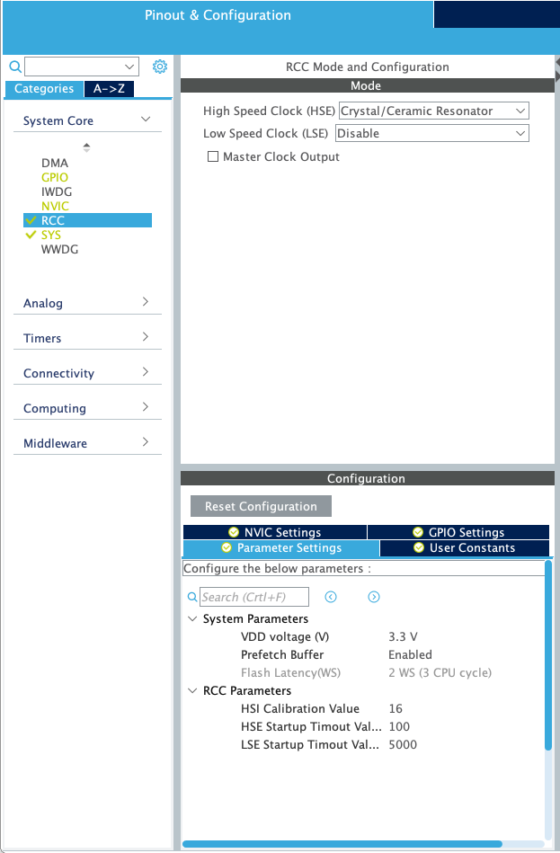
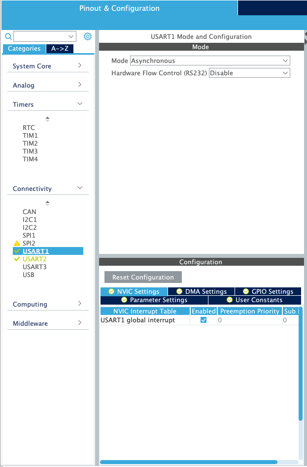
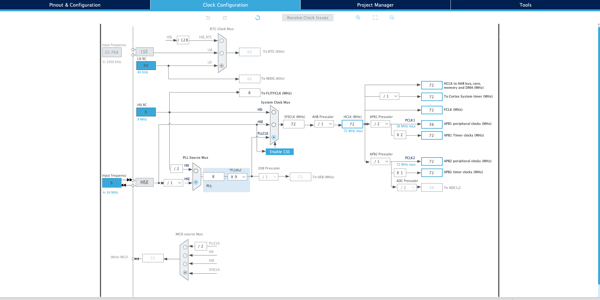
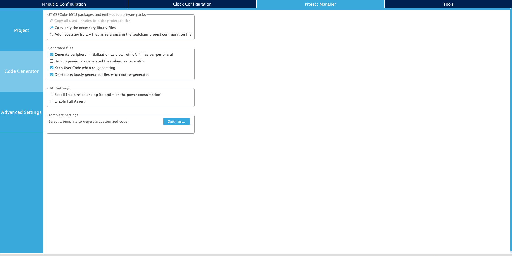
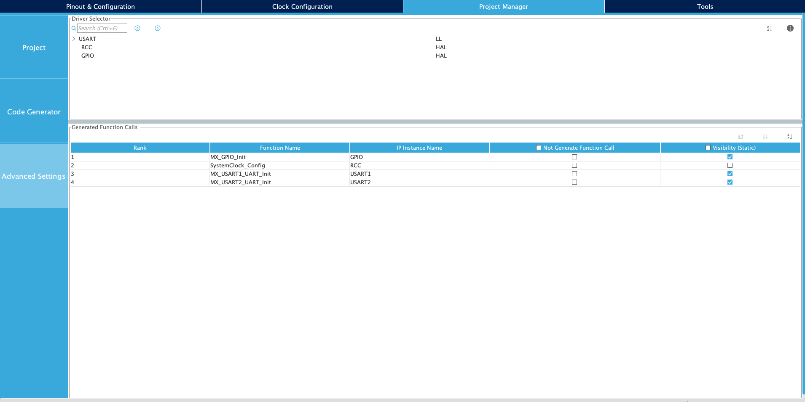

# Africa's Talking v1 R1 Dev Kit SIM 800C Sample for STM32CubeIDE

## TLDR; 

> To get **up and running quickly** with this sample, follow the steps below:

1. Insert the activated IoT SIM into the SIM Slot

2. Attach the antenna

3. Flash `./Dist/atdevkitgsm.bin` in to your dev kit. 

4. Open Serial to view SIM Connection status


> For a detailed write up, read below 

- See overrall config as shown below 
 

- Set `PB15` to `GPIOOutput` as shown. This will be your `GSM Power Key`.
- Also set `PC13` to `GPIOOutput`; this is the on-board LED.


- Set `HSE` to `Crystal/Ceramic Resonator` and **disable** `LSE` as shown
 

- Set serial mode to `Asynchronous` for both  `USART1` and `USART2` and **ensure `gloabl interrupt` is enabled under `NVIC Settings`** 
 

## Clock Configuration 
- See below clock configuration.
    - Toggle `PLL` and `PLLCLK`
    - Set input frequency to `8Mhz`

- You might want to set the multiplier `PLLMul` to **11 or above** then click `Resolve Clock Issues` 


## Project Management 
- Under Project Manager ensure `Generate peripheral initialization...` is checked 
 

- Then inside `Advanced Settings` Set USART driver to `LL`  



**SAVE AND GENERATE PROJECT**

## Important 

- See the APN configuration inside `./Core/Src/main.c` 

- Note that the line shown below is commented under `./Core/Src/syscalls.c` 

```c 
extern int __io_putchar(int ch) __attribute__((weak)); 
``` 
- Also note that an IRQ handler is required for USART1; see `./Core/Src/stm32f1xx_it.c`.

- Note the **differences** under `./Core/{*}/usart.{*}` 
